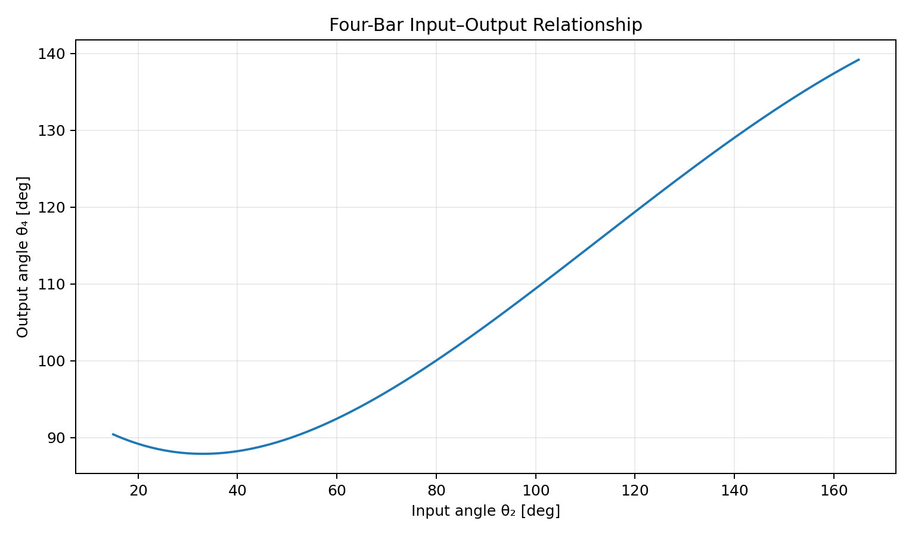
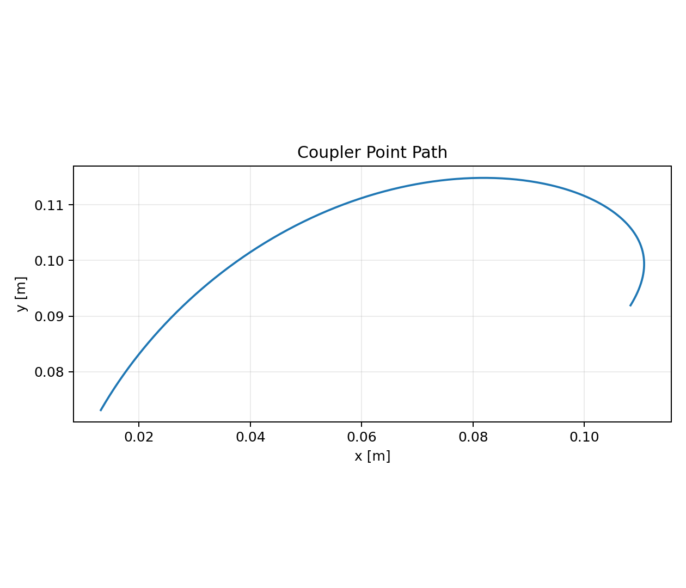

# Planar Mechanism Kinematics Toolkit

A Python + MATLAB project for the computational position analysis of common planar mechanisms. The initial release implements **four-bar linkage** and **slider-crank** kinematics.




## What this project demonstrates

- planar mechanism geometry
- loop-closure reasoning
- two-branch four-bar assembly solutions
- Grashof classification
- transmission-angle analysis
- coupler-point path generation
- slider-crank displacement analysis
- Python and MATLAB implementations
- automated tests and CI

## Implemented mechanisms

### Four-bar linkage

Links follow the convention:

- `a`: input crank
- `b`: coupler
- `c`: output rocker
- `d`: fixed ground link

The solver uses circle-circle intersection to construct the mechanism directly from the input angle and link lengths.

### Slider-crank

The inline slider-crank model computes slider displacement and connecting-rod angle over a full crank revolution.

## Run the Python version

```bash
python -m venv .venv
# Windows: .venv\Scripts\activate
# Linux/macOS: source .venv/bin/activate
pip install -e . pytest
python examples/four_bar_analysis.py
python examples/slider_crank_analysis.py
pytest -q
```

MATLAB equivalents are provided in [`matlab/`](matlab/).

## Current release: v0.1

- four-bar position solver
- branch selection
- Grashof check
- transmission-angle calculation example
- coupler-curve generation
- slider-crank position model
- MATLAB comparison scripts
- tests and cross-platform CI

## Planned extensions

- analytical velocity and acceleration analysis
- instantaneous centers
- mechanical advantage
- transmission-angle quality metrics
- animation export
- mechanism synthesis examples
